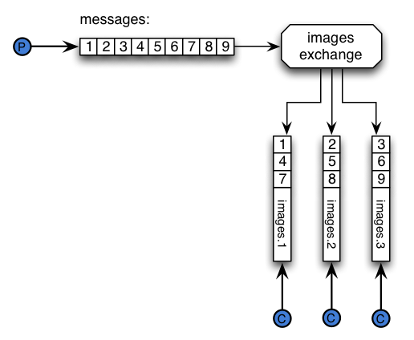

# RabbitMQ Sharding Plugin #

This plugin introduces the concept of sharded queues for
RabbitMQ. Sharding is done at the exchange level, that is, messages
will be partitioned across queues by one exchange that we should
define as sharded. The machinery used behind the scenes implies
defining an exchange that will partition, or shard messages across
queues. The partitioning will be done automatically for you, i.e: once
you define an exchange as _sharded_, then the supporting queues will
be automatically created and messages will be sharded across them.

The strategy for deciding how many queues will be created per shard
can be either done via de plugin defaults or set by the user via
configuration parameters.

The following graphic depicts how the plugin works from the standpoint
of a publisher and a consumer:



As you can see in the graphic, the producers publishes a series of
messages, those messages get partitioned to different queues, and then
our consumer get messages from one of those queues. Therefore if you
have a partition with 3 queues, then you will need to have at least 3
consumers to get all the messages from those queues.

## Auto-scaling ##

One interesting property of this plugin, is that if you add more nodes
to your RabbitMQ cluster, then the plugin will automatically create
more shards in the new node. Say you had a shard with 4 queues in
`node a` and `node b` just joined the cluster. The plugin will
automatically create 4 queues in `node b` and join them to the shard
partition. Already delivered messages _will not_ be rebalanced, but
newly arriving messages will be partitioned to the new queues.

## Partitioning Messages ##

The exchanges that ship by default with RabbitMQ work in a "all or
nothing" fashion, i.e: if a routing key matches a set of queues bound
to the exchange, then RabbitMQ will route the message to all the
queues in that set. Therefore for this plugin to work, we need to
route messages to an exchange that would partition messages, so they
are routed to _at most_ one queue. To achieve that, we recommend the
use of the _Consistent Hash Exchange_ or the _Random Exchange_.  The
first one has the advantage of shipping directly with RabbitMQ. (It's
worth noting that at the moment the plugin only works with those kind
of exchanges).

## Consuming from a sharded queue ##

While the plugin creates a bunch of queues behind the scenes, the idea
is that those queues act like a big logical queue where you consume
messages from. The plugin uses a new Erlang behaviour introduced in
the latest development version of RabbitMQ that allows the plugin to
re-route calls to _basic.consume_ to a different queue from the
original one required by the user.

An example should illustrate this better: let's say you declared the
exchange _images_ to be a sharded exchange. Then RabbitMQ created
behind the scenes queues _shard: - nodename images 1_, _shard: -
nodename images 2_, _shard: - nodename images 3_ and _shard: -
nodename images 4_. Of course you don't want to tie your application
to the naming conventions of this plugin. What you would want to do is
to perform a `basic.consume('images')` and let RabbitMQ figure out the
rest. This plugin does exactly that.

TL;DR: if you have a shard called _images_, then you can directly
consume from a queue called _images_.

How does it work? The plugin will chose the queue from the shard with
the _least amount of consumers_, provided the queue contents are local
to the broker you are connected to.

## Why? ##

Why do we need this? RabbitMQ queues are bound to the node where they
were first declared. This means that even if you create a cluster of
RabbitMQ brokers, at some point all message traffic will go to the
node where the queue lives. What this plugin does is to give you a
centralized place where to send your messages, plus __load balancing__
across many nodes, by adding queues to the other nodes in the cluster.

The advantage of this setup is that the queues from where your
consumers will get messages will be local to the node where they are
connected.  On the other hand, the producers don't need to care about
what's behind the exchange.

All the plumbing to __automatically maintain__ the shard queues is
done by the plugin. If you add more nodes to the cluster, then the
plugin will __automatically create queues in those nodes__.

If you remove nodes from the cluster then RabbitMQ will take care of
taking them out of the list of bound queues. Message loss can happen
in the case where a race occurs from a node going away and your
message arriving to the shard exchange. If you can't afford to lose a
message then you can use
[publisher confirms](http://www.rabbitmq.com/confirms.html) to prevent
message loss.

## Message Ordering ##

Message order is maintained per sharded queue, but not globally. This
means that once a message entered a queue, then for that queue and the
set of consumers attached to the queue, ordering will be preserved.

If you need global ordering then stick with
[mirrored queues](http://www.rabbitmq.com/ha.html).

## Building the plugin ##

The plugin currently builds against the default (development) branch
of RabbitMQ.

Get the RabbitMQ Public Umbrella ready as explained in the
[RabbitMQ Plugin Development Guide](http://www.rabbitmq.com/plugin-development.html).

Move to the umbrella folder an then run the following commands, to
fetch dependencies:

```bash
git clone https://github.com/jbrisbin/random-exchange.git
hg clone http://hg.rabbitmq.com/rabbitmq-sharding/
cd rabbitmq-server
hg up default
cd ../rabbitmq-sharding
make
```

## Testing the plugin ##

Here's how to start a two node RabbitMQ cluster and get the
`rabbitmq-sharding` plugin running in it.

Enable the following plugins as explained in the
[RabbitMQ Plugin Development Guide](http://www.rabbitmq.com/plugin-development.html):

Then run `make run-in-broker`.

On a separate Terminal window run the following commands to start a
second RabbitMQ node.

First setup the enabled plugins for the other node:

```bash
echo '[amqp_client,rabbitmq_consistent_hash_exchange,rabbitmq_sharding, rabbitmq_management_agent, random_exchange].' > other_plugins export RABBITMQ_ENABLED_PLUGINS_FILE=other_plugins
```

Then start the other node and cluster it:

```bash
make start-other-node OTHER_NODE=rabbit2 OTHER_PORT=5673
make cluster-other-node MAIN_NODE=rabbit-test@hostname OTHER_NODE=rabbit2
```

You could repeat the previous two steps to start a couple more
nodes. Don't forget to change the `OTHER_NODE` and `OTHER_PORT`
values.

So far we have a RabbitMQ cluster. Now it's time to add a policy to
tell RabbitMQ to make some exchanges as shards.

First we will add a `sharding-definition` parameter that will tell the
plugin how many `shards-per-node` we want to create, and what's the
routing key to use when binding the sharded queues to our exchange. If
you use the consistent hash exchange then the routing keys need to be
"an integer as a string", since routing keys in AMQP must be strings.

```bash
../rabbitmq-server/scripts/rabbitmqctl set_parameter sharding-definition my_shard '{"sharded": true, "shards-per-node": 2, "routing-key": "1234"}'
```

That parameter will tell the plugin to create 2 sharded queues per
node. Based on the number of cores in your server, you need to decide
how many `shards-per-node` you want. And finally the routing key used
in this case will be `"1234"`. That routing key will apply in the
context of a consistent hash exchange. The `sharded` key is mandatory
for the exchange to be sharded.

Let's add our policy now:

```bash
../rabbitmq-server/scripts/rabbitmqctl -n rabbit-test@hostname set_policy my_shard "^shard\." '{"sharding-definition": "my_shard"}'
```

That policy will create a shard called `my_shard` for all exchanges
whose name start with `shard.`, whose `sharding-definition` will be
the one called `my_shard` that we've just defined.

Then if you declare an exchange called for example `shard.logs_shard`
the plugin will create two queues per node in the cluster.  So if we
have a cluster of nodes `[rabbit1, rabbit2, rabbit3]`, we will get the
following queues in the cluster:

```
shard: shard.logs_shard - rabbit1@hostname - 0
shard: shard.logs_shard - rabbit1@hostname - 1

shard: shard.logs_shard - rabbit2@hostname - 0
shard: shard.logs_shard - rabbit2@hostname - 1

shard: shard.logs_shard - rabbit3@hostname - 0
shard: shard.logs_shard - rabbit3@hostname - 1
```

Each queue will be local to the node included in its name. Sharded
queues names will have the `shard:` prefix in their names, and an
index suffix starting at zero.

### What strategy is used for picking the queue name ###

When you issue a `basic.consume`, the plugin will choose the queue
with the _least amount of consumers_.  The queue will be local to the
broker your client is connected to. Of course the local sharded queue
will be part of the set of queues that belong to the chosen shard.

## Configuration parameters ##

The following configuration parameters affect the plugin behaviour:

- `shards-per-node`: How many sharded queues to create per node. This
  could depend on the amount of cores in your server. Defaults to `1`.
- `routing-key`: The routing key used when the plugin binds the queues
  to the shard exchange. Defaults to `"10000"`.

First the parameters specified in the `sharding-definition` applies,
if one of them is not set there, then the plugin defaults to global
parameters. Finally it will use the default plugin values.

To set a parameter for the plugin, you could use the following
command:

```bash
rabbitmqctl set_parameter sharding routing-key '"4321"'
```

That will set a global parameter for routing keys used by the plugin.

## Examples ##

Inside the `etc` folder you can find a set of shell scripts where you
can see how to set the various policies and parameters supported by
the plugin.

## Plugin Status ##

At the moment the plugin is __experimental__ in order to receive
feedback from the community.

## Intercepted Channel Behaviour ##

This plugin works with the new `channel interceptors`. An interceptor
basically allows a plugin to modify parts of an AMQP method. For
example in this plugin case, whenever a user sends a `basic.consume`,
the plugin will map the queue name sent by the user to one of the
sharded queues.

Also a plugin can decide that a certain AMQP method can't be performed
on a queue that's managed by the plugin. In this case declaring a queue
called `my_shard` doesn't make much sense when there's actually a
sharded queue by that name. In this case the plugin will return a
channel error to the user.

These are the AMPQ methods intercepted by the plugin, and the
respective behaviour:

- `'basic.consume', QueueName`: The plugin will pick the sharded queue
  with the least amount of consumers from the `QueueName` shard.
- `'basic.get', QueueName`: The plugin will pick the sharded queue
  with the least amount of consumers from the `QueueName` shard.
- `'queue.declare', QueueName`: The plugin forbids declaring queues
  with the same name of an existing shard, since `basic.consume`
  behaviour would be undefined.
- `'queue.bind', QueueName`: since there isn't an actual `QueueName`
  queue, this method returns a channel error.
- `'queue.unbind', QueueName`: since there isn't an actual `QueueName`
  queue, this method returns a channel error.
- `'queue.purge', QueueName`: since there isn't an actual `QueueName`
  queue, this method returns a channel error.
- `'queue.delete', QueueName`: since there isn't an actual `QueueName`
  queue, this method returns a channel error.

## LICENSE ##

See the LICENSE file.
