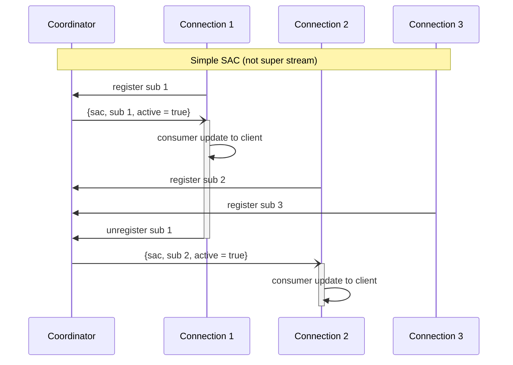
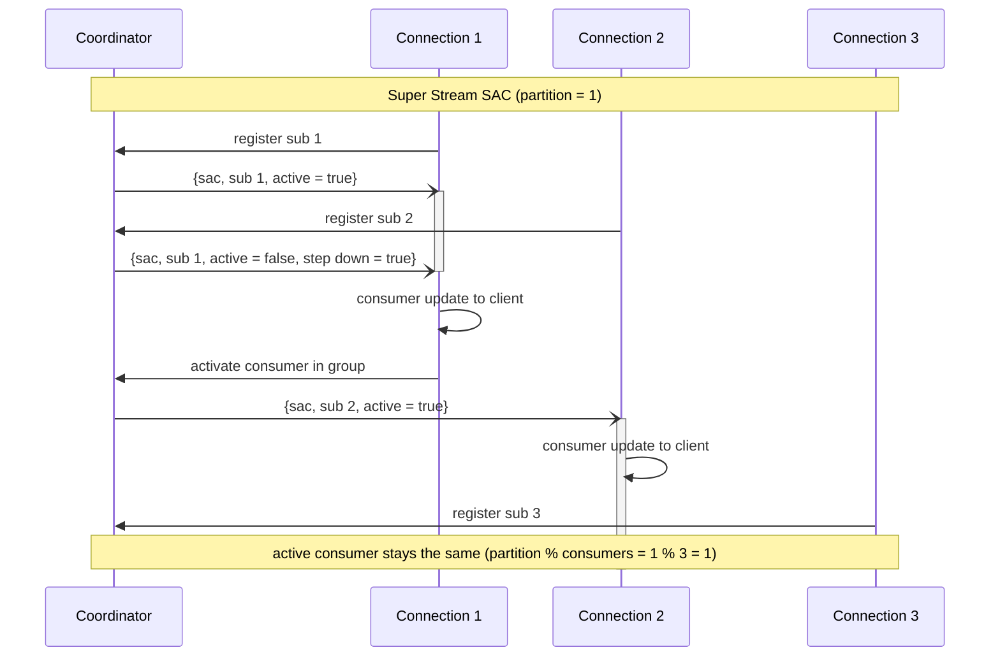
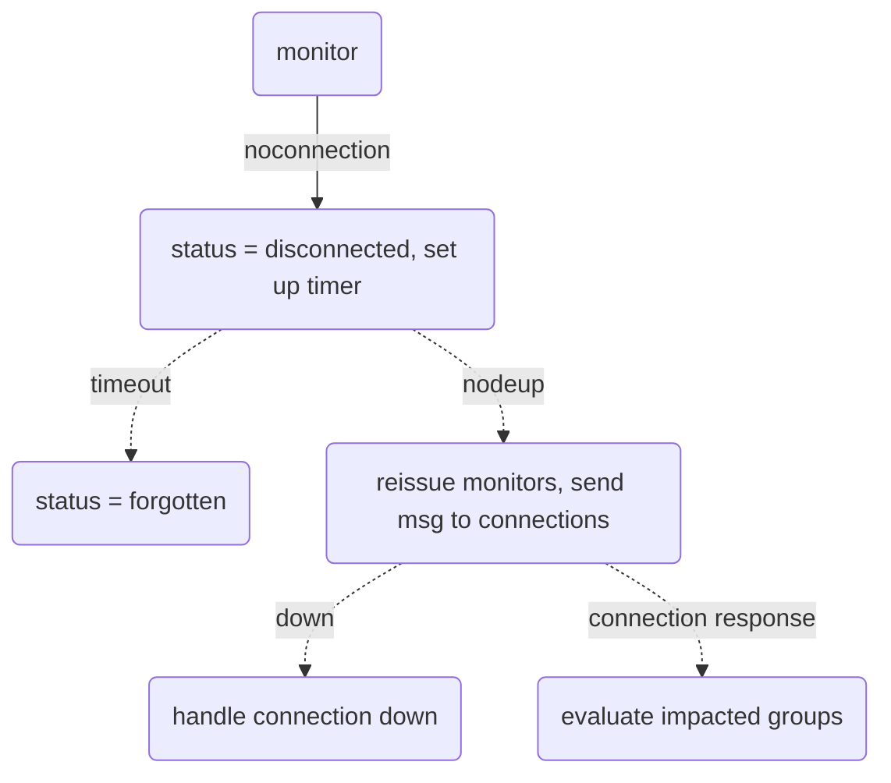
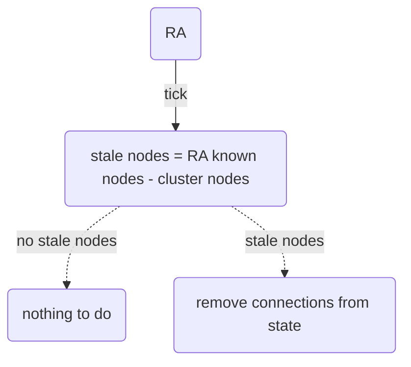

# Stream Coordinator

## Single Active Consumer

### "Simple" SAC (Not Super Stream)

### SAC with Super Stream Partition

### `noconnection` management 

* composite status for consumers: `{connected, active}`, `{disconnected,active}`, etc.
* `disconnected` status can prevent rebalancing in a group, e.g. `{disconnected, active}` (it is impossible to tell the active consumer to step down)
* consumers in `forgotten` status are ignored during rebalancing
* it may be necessary to reconcile a group if a `{forgotten, active}` consumer comes back in a group ("evaluate impacted groups" box above).
This is unlikely though.

### Stale Node Detection

